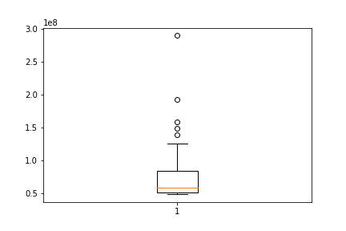
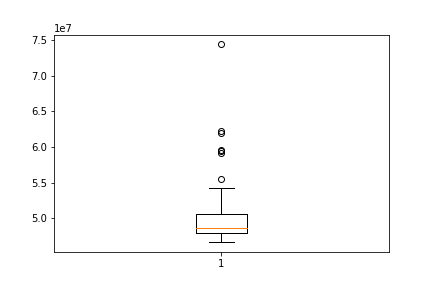
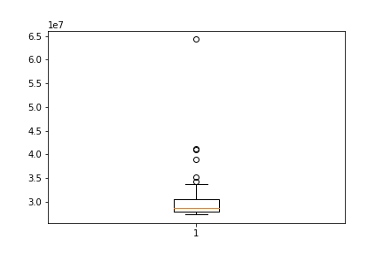
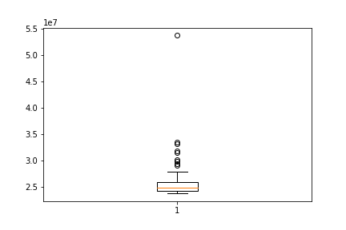

# Assignment 2

## Objectives

You need to make it run at least 50% faster than it is now, and should be able to get to around 100% faster.
Hand-in: should contain the following:

* Documentation of the current performance (remember mean and standard deviation -- see the Sestoft paper!)
* An explanation of the bottlenecks in the program.
* A hypothesis of what is causing the problem,
* A changed program which is improved to solve the problem.
* Documentation of the new performance.

_Notice: there might be more than one optimization needed to achieve optimal performance._

## Hypothesis & Bottlenecks

A call is made to read a system file each time `FileReader` is called. A `FileReader` will make 256 calls for reading 256 characters from file.

`try/catch` is reducing the performance due to its check and preparation of potential exceptions.

```java
private static void tallyChars(Reader reader, Map<Integer, Long> freq) throws IOException {
    int b;
    while ((b = reader.read()) != -1) {
        try {
            freq.put(b, freq.get(b) + 1);
        } catch (NullPointerException np) {
            freq.put(b, 1L);
        };
    }
}
```

## Optimization
### Tally Chars Custom 1

This method uses `freq.getOrDefault` instead of using `try/catch` that checks if the `Key` exists and then throws an exception if it doesn't.

```java
private static void tallyCharsCustom1(Reader reader, Map<Integer, Long> freq) throws IOException {
    int b;
    while ((b = reader.read()) != -1) {
        freq.put(b, freq.getOrDefault(b, 0L) + 1L);
    }
}
```

### Tally Chars Custom 2

In addition to `tallyCharsCustom1` this method makes use of the `BufferedReader` which uses a memory buffer to optimize reading time. 

```java
private static void tallyCharsCustom2(Reader reader, Map<Integer, Long> freq) throws IOException {
    int b;
    BufferedReader br = new BufferedReader(reader);

    while ((b = br.read()) != -1) {
        freq.put(b, freq.getOrDefault(b, 0L) + 1L);
    }
}
```

### Tally Chars Custom 3

Using `byte[]` optimizes performance because it is a simple data structure. This reduces unnecessary operations and therefore optimizes performance time.


```java
private static void tallyCharsCustom3(byte [] fileBytes, Map<Integer, Long> freq) throws IOException {
    int singleInt;
    for(byte b : fileBytes) {
        singleInt = (int) b;
        freq.put(singleInt, freq.getOrDefault(singleInt, 0L) + 1);
    }
}
```

## Performance

### Tally Chars

std: 44704672.3019  
mean: 77245155.5800  

### Tally Chars Custom 1

std: 5212312.7555  
mean: 50741955.4000  

### Tally Chars Custom 2

std: 5884498.2695  
mean: 30583595.9400  

### Tally Chars Custom 3

std: 4698149.1470  
mean: 26328980.2800  

### Conclusion

The third alteration of the the `tallyChars` method has the best performance with approximately `293.38%`

## Resources

We used a [jupyter notebook](src/analysis/notebook.ipynb) to analyse the collected [performance data](src/analysis/observations.csv).
